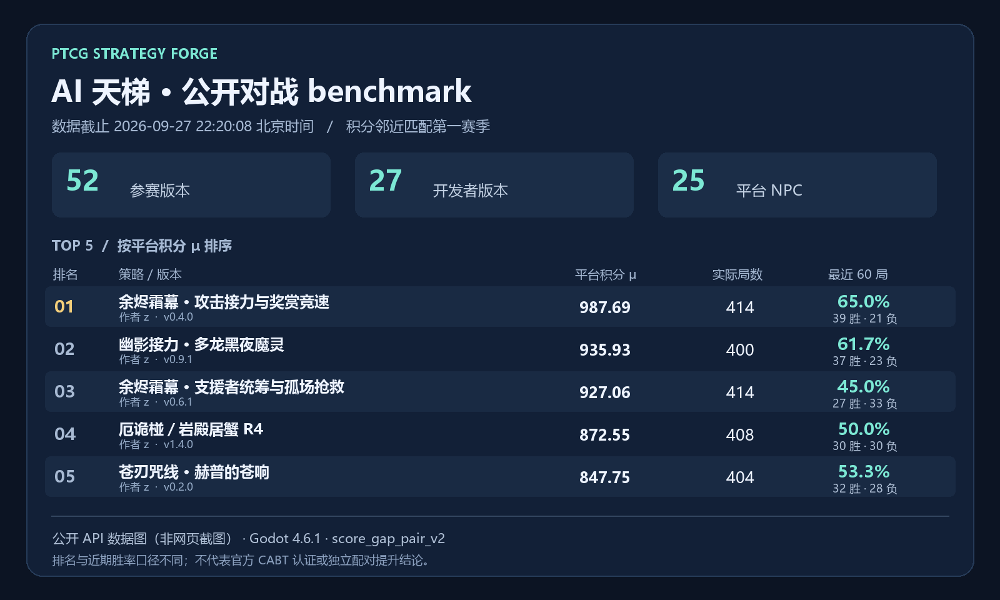

# PTCG Strategy Forge · AI 训练家的工具包

**把牌组理解变成能参加 AI 天梯的 AI 选手。** Forge 为 AI 训练家提供规则构筑、公开决策数据、模型训练与接入、场景回归、对战评估、构建签名和提交工具。你可以亲自编写策略，也可以让 Codex、WorkBuddy 等编程助手协助完成迭代。

这是独立的 SDK 与开发工具仓库。本次更新发布通用框架、合同和测试；个人参赛策略、训练权重、实验工作区、API Key 与签名私钥留在作者自己的环境。

## 先离线跑通 Marnie RED→GREEN demo

安装依赖后，先体验自带的 [Marnie 示例](demo/marnie-forge)，无需注册、API Key 或游戏仓库。在仓库根目录运行：

```powershell
.\setup.ps1
.\forge.ps1 demo --output work\first-marnie-demo
```

输出目录必须不存在；重复运行请换一个目录。打开 `work/first-marnie-demo/demo-report.json`，成功时应看到 `status=passed`、`optimization.baseline_red=true`、10/10 场景通过和 `build.deterministic=true`。RED 是故意失败的基线，GREEN 包含修正后的选择、option 重排与安全负例。这是本地开发证据，不是平台资格或实战胜率。

随后按[快速入门](docs/01-QUICKSTART.md)创建自己的工作区；准备提交时再连接开发者账号。

## 让 Codex、WorkBuddy 带你完成第一次提交

把[Agent 任务书](docs/31-AGENT-START.md)交给编程助手，并告诉它你的牌组或策略想法。它会检查环境、开发和测试策略、完成本机签名、提交并跟进资格结果；你只需完成必要的账号验证和本机凭据输入。已有工作区也可以从当前进度继续。

## 天梯完整决策录像

使用已登录账号按版本下载本人视角，验证后导入本地复盘。见 [天梯决策录像](docs/27-ONLINE-DECISION-TRACES.md)。服务需要声明对应能力，旧摘要不能恢复完整窗口。

<p align="center">
  <a href="https://ptcg.skillserver.cn/">
    
  </a>
</p>

<p align="center">
  <strong>把你对一套牌的理解，变成能测试、能签名、能参加 AI 天梯、也能被玩家真正挑战的 PTCG AI Agent。</strong>
</p>

<p align="center">
  <a href="docs/01-QUICKSTART.md">快速开始</a>
  ·
  <a href="https://ptcg.skillserver.cn/dist/developer-guide.html">完整开发者指南</a>
  ·
  <a href="https://ptcg.skillserver.cn/dist/developers.html">开发者中心</a>
  ·
  <a href="https://ptcg.skillserver.cn/dist/competition.html">AI 策略天梯</a>
  ·
  <a href="https://github.com/beralee/PtcgDeckAgent">PTCG Deck Agent</a>
</p>

PTCG Strategy Forge 是独立的 `.ptcgai` 策略开发工具链。你可以从一个牌组思路出发，编写纯规则策略，或导入 BC/RL 冻结模型；在同一个工作区里完成公开局面检查、场景回归、确定性构建、本地安装和发布签名。

开发 Forge 策略不需要检出 PtcgDAP 游戏仓库，也不需要先成为 Godot 或规则引擎开发者。日常工作集中在策略蓝图、data-only 规则和可复现测试场景。

## 为什么来这里开发策略

- **策略有真实去向**：通过本地验收和平台资格门后，策略可以进入持续运行的 [AI 策略天梯](https://ptcg.skillserver.cn/dist/competition.html)，与内置和社区策略对战，并被玩家加载挑战。
- **规则与模型走同一条路**：纯规则、BC、RL、BC→RL 和混合策略最终都交付为统一的 `.ptcgai v2`，不必维护两套发布流程。
- **先证明决策，再追胜率**：用固定局面、语义 option 重排、安全负例和确定性双构建，定位第一处错误选择，而不是只盯最终胜负。
- **公平的公开信息边界**：所有策略只读取玩家当前可见的信息，并只在当前合法选择窗口中行动；隐藏牌和引擎私有状态不会成为“策略优势”。
- **安全、可分发的数据包**：`.ptcgai` 不携带任意 Python、GDScript、原生插件或网络执行能力，优秀策略可以安全地走向玩家客户端。
- **不必从零搭工具链**：工作区脚手架、已审核牌组、支持卡牌快照、场景 runner、Host 校验、模型 conformance、构建和签名流程已经连成一条开发路径。

如果你擅长牌组理解、规则系统、策略搜索、模仿学习或强化学习，这里都可以成为同一个公开竞技场上的不同解法。

## AI 天梯：持续对战的 benchmark

[AI 策略天梯](https://ptcg.skillserver.cn/dist/competition.html) 是策略开发后的公开对战与反馈入口：开发者提交精确版本的 `.ptcgai`，通过平台资格后，与社区策略和内置 NPC 参加双座位系列对局；公开榜单展示策略榜、作者榜、积分、场次与近期胜率，失败录像则为下一轮回归提供线索。

**2026-09-27 22:20:08（北京时间）公开快照：52 个参赛版本，其中 27 个开发者版本、25 个平台 NPC。** 下表按快照排名列出前五名，均为作者 `z` 的开发者策略；不同版本单独占一行，不等于五种独立牌组。



*依据公开 API 快照绘制的榜单图，并非网页截图。数据与名次会变化；[打开实时天梯](https://ptcg.skillserver.cn/dist/competition.html)。*

| 排名 | 策略 / 版本 | 平台积分 μ | 已计分组 / 实际局 | 最近 60 局 |
|---:|---|---:|---:|---:|
| 1 | [余烬霜幕 · 攻击接力与奖赏竞速](https://ptcg.skillserver.cn/dist/strategy.html?release_id=release-b721ed7f55b4c2d4b1b93eb5659d770035d033b0) · 0.4.0 | 987.69 | 207 / 414 | 39 胜 21 负 · 65.0% |
| 2 | [幽影接力 · 18.5 多龙黑夜魔灵](https://ptcg.skillserver.cn/dist/strategy.html?release_id=release-cf196388c350c2d1d81de05682f03a09f60d5cb8) · 0.9.1 | 935.93 | 200 / 400 | 37 胜 23 负 · 61.7% |
| 3 | [余烬霜幕 · 支援者统筹与孤场抢救](https://ptcg.skillserver.cn/dist/strategy.html?release_id=release-9027dadefc5dfa2b534c7b16b0244bccf59d774e) · 0.6.1 | 927.06 | 207 / 414 | 27 胜 33 负 · 45.0% |
| 4 | [厄诡椪／岩殿居蟹 R4](https://ptcg.skillserver.cn/dist/strategy.html?release_id=release-e3794d686875434b30c51f45730b885c9e38808c) · 1.4.0 | 872.55 | 204 / 408 | 30 胜 30 负 · 50.0% |
| 5 | [苍刃咒线 · 赫普的苍响](https://ptcg.skillserver.cn/dist/strategy.html?release_id=release-8dda7b942cf9c5e6300273bad82dd85bb7c3b10e) · 0.2.0 | 847.75 | 202 / 404 | 32 胜 28 负 · 53.3% |

这里的 benchmark 衡量**指定引擎、赛季、对手池和策略版本下的实际对战表现**。当前赛季采用 `score_gap_pair_v2`，榜单按积分 `μ` 降序；最近 60 局胜率是近期记录，不是历史总胜率，名次也不按这列直接排序。前两名近期分别为 39/60、37/60，说明这些版本已在该对手池积累实战表现；不能由此推断 SDK、某种训练方法或更高版本必然更强。

平台快照标注引擎为 Godot 4.6.1，证据范围为 `windows_local_stopped_snapshot`，并明确 `official_cabt_validated=false`、`production_ready=false`。这是一项社区研究 benchmark，不能称作官方 PTCG/CABT 认证、人类水平测试或独立配对提升实验。公开成绩不包含策略源码与训练权重。

完整字段、统计口径、冻结快照与比较方法见 [AI 天梯 benchmark 说明](docs/37-AI-LADDER-BENCHMARK.md)。

## 从一个想法到 AI 天梯

```text
选择牌组与胜利路线
  → 创建 Forge 工作区
  → 编写规则，或导入冻结 Actor
  → 用场景做 RED→GREEN 迭代
  → check / build 得到确定性 .ptcgai
  → 登记公钥，再由 submit 在本机签名上传
  → 保存已接收的 release 回执，等待运行资格 passed
  → 单独核对该 release 的天梯计分对局
  → 从真实对局、录像与玩家反馈继续迭代
```

本地开发通过、平台资格通过、天梯表现、Godot 规则见证、CABT 一致性和 production 批准是不同的门。Forge 会明确告诉你当前证据证明了什么，不用一次本地成功冒充更高等级的结论。

## 先跑起你的第一个策略

当前作者工具链要求 Windows 和 Python 3.13。先使用系统自带 Windows PowerShell 5.1 或已有 PowerShell 7；`setup.ps1` / `forge.ps1` 未依赖 PowerShell 7 专用语法，遇到具体 Shell 兼容错误时再处理或升级，不必预先安装 PowerShell 7。若本机策略禁止 `.ps1`，可使用[快速入门的 Python 入口](docs/01-QUICKSTART.md#安装和自检)，无需永久放宽执行策略。离线 demo 通过、准备接入账号时，按下面两种情况选择一种登录方式。

```powershell
git clone https://github.com/beralee/ptcg-strategy-forge.git
cd ptcg-strategy-forge
.\setup.ps1
.\forge.ps1 doctor
```

**刚注册、没有 API Key：** 完成邮箱验证后，在自己的可交互终端运行；用户名账号把 `--email YOUR_EMAIL` 替换为 `--username YOUR_USERNAME`，在隐藏提示中输入账号密码，无需先去网页寻找 API Key。

```powershell
.\forge.ps1 account login --origin https://api.ptcg.skillserver.cn --email YOUR_EMAIL
```

**已有 API Key：** 保留原流程，在隐藏提示中输入 API Key。

```powershell
.\forge.ps1 account login --origin https://api.ptcg.skillserver.cn
```

登录由开发者在本机按助手权限要求确认后执行。密码登录会创建 CLI API Key；两种登录方式均将 API Key 保存到 Windows 当前用户凭据管理器。密码、API Key 和签名私钥不得发送到聊天或写进命令参数。助手无法提供可交互的隐藏输入时，由开发者在自己的终端完成这一步，详见 [Agent 账号接入](docs/31-AGENT-START.md#3-准备提交时接入账号由工具读取完整身份)。

登录成功后继续：

```powershell
.\forge.ps1 account whoami
.\forge.ps1 workspace create work\my-strategy `
  --account `
  --package-id dev.myname.my-strategy `
  --author-name "你的显示名称"

.\forge.ps1 workspace status work\my-strategy
```

正式工作区应显式使用简短、稳定且全局唯一的 `--package-id`。它是策略身份，不是显示名称，也不需要复制较长的开发者 ID。

第一次迭代只需要关注三个位置：

1. `STRATEGY-BLUEPRINT.md`：写清怎么赢、攻击节奏、资源给谁，以及何时必须重新规划；
2. `package/policy/adapter.json`：把当前合同能表达的目标、macro 和同层偏好写成 data-only 规则；
3. `scenarios/`：用正例、负例和 option 重排固定你期望的决策。

然后进入最短反馈循环：

```powershell
.\forge.ps1 workspace inspect work\my-strategy
.\forge.ps1 workspace check work\my-strategy
.\forge.ps1 workspace build work\my-strategy
.\forge.ps1 workspace install work\my-strategy
```

`inspect` 把一次原始选择翻译成可读的公开事实和语义选项。`check` 会执行两次精确构建、比较字节与哈希、严格走 Host 路径并运行完整场景；全部通过后，`build` 才会写出 `.ptcgai` 和验收报告。

完整无网页流程、远端版本管理和 CI 用法见 [CLI 完整性审查与工作流](docs/26-CLI-ONLY-DEVELOPMENT.md)。API Key 用于账号认证，Ed25519 私钥用于本机签名，两者不能替代。上传前先登记公钥，再由 `workspace release submit` 本机签名上传；已接收 release、运行资格 `passed` 和已有计分对局分别验证。

## 选择你的开发方式

| 你想做什么 | 工作区模式 | 适合的起点 |
|---|---|---|
| 把明确牌序、资源分配和对局原则写成策略 | `--mode rules` | data-only Competitive IR、macro、偏好和场景 |
| 从专家对局学习，再用离线反馈优化 | `--mode model` | BC、contextual-bandit RL 或 BC→RL Actor |
| 用规则守住底线，让模型处理同层细节 | `--mode model` | 规则 fallback + 冻结 CPU ORT Actor |

两种模式都由 Base Graph 保护合法性、强制/终局选择、hard tier、veto 和确定性 fallback。模型只在规则允许的当前候选域内评分；异常、超时、未知 UID/shape 或非法输出会回到规则/Base，而不是接管引擎。

模型工作区的典型接入流程：

```powershell
.\forge.ps1 workspace create work\my-model-strategy `
  --author-id $developerId `
  --package-id dev.myname.my-model-strategy `
  --mode model

.\forge.ps1 workspace model inspect work\my-model-strategy `
  --artifact exports\actor.onnx

.\forge.ps1 workspace model import work\my-model-strategy `
  --source exports\actor.onnx `
  --training-method bc_rl `
  --source-run-id run-001

.\forge.ps1 workspace model conformance work\my-model-strategy
.\forge.ps1 workspace check work\my-model-strategy
```

Forge 提供可选的 BC、公开语义特征与受控收益研究工具，也允许接入你自己的训练循环；公开张量、无状态 Actor 合同、ORT 导入检查和运行裁决保持固定。可执行的最小 BC→离线 contextual-bandit RL 示例见 [`examples/minimal-bc-rl-marnie`](examples/minimal-bc-rl-marnie)。

## 把“会打这套牌”变成可验证策略

通用规则构筑与复盘可以使用 [`StrategyBase`](docs/35-STRATEGY-BASE-FRAMEWORK.md) 和 [`ptcg-strategy-base`](skills/ptcg-strategy-base/SKILL.md)：审核 16 项设计要素，编译分阶段路线，并从已校验录像提取待验证的改进假设。


好的策略不只是给每个按钮一个分数。Forge 鼓励你同时表达四个尺度：

1. **比赛议程**：赢法是什么，最快和最稳的奖赏路线分别是什么，谁是主攻手、引擎和备用攻击手；
2. **当前路线**：这一回合怎样精确支付资源，怎样应对可信的对手反击，怎样保证下一攻击窗口不断档；
3. **信息检查点**：抽牌、检索、展示和随机结果出现后，旧假设失效，条件后缀必须重新观察再决定；
4. **当前窗口交互**：这一次检索、弃牌、分配、换位、选目标或伤害分配到底选什么。

先把完整意图写进 `STRATEGY-BLUEPRINT.md`，再把当前运行合同支持的部分编译进 adapter。这样即使某个跨窗口计划暂时不能执行，设计意图、已实现行为和未来缺口也不会混在一起。

## 用失败局驱动下一版

一个有效的迭代通常长这样：

```text
发现错误决策
  → 抽取当时的公开窗口
  → 写成先失败的场景
  → 找到 observation / identity / adapter / Base / interaction 中最早的 owning layer
  → 做最小修改
  → 增加语义相同但 option 顺序不同的场景
  → 增加缺少前置条件、强制选择、veto、未知 UID 和隐藏字段负例
  → 全套 check 后再发布新版本
```

这让策略改进拥有可复现的理由：你可以说明哪一个公开事实改变了决策、为什么改变，以及旧版本如何安全回滚。

## 从已审核牌组开始

`workspace create --deck-id <id>` 可以直接生成精确 60 卡、固定本地 UID、牌组专用蓝图、adapter 和场景起点：

| deck id | 牌组 |
|---:|---|
| `800018501` | 玛俐长毛巨魔 |
| `646600` | 玛俐的礼盒 |
| `800017097` | 无碟沙奈朵 |
| `800018499` | 多龙巴鲁托 |
| `800018509` | 猛雷鼓厄诡椪 |
| `800018502` | N 的索罗亚克 |
| `800018880` | 阿响的火暴兽 |
| `800052301` | 厄诡椪／岩殿居蟹迁移 |

例如：

```powershell
.\forge.ps1 workspace create work\gardevoir `
  --author-id $developerId `
  --package-id dev.myname.gardevoir `
  --strategy-name "18.0 无碟沙奈朵" `
  --deck-id 800017097
```

名单外牌组需要先审核精确 deck/card identity 与本地 UID，不能只替换显示名称。工作区中的 `SUPPORTED-CARDS.json` 可查询当前卡牌的 `usable` 和 `interaction_status`；仓库同源快照见 [`data/developer/supported-cards-v1.json`](data/developer/supported-cards-v1.json)。

## 一个工作区已经为你准备了什么

```text
my-strategy/
  README.md                  日常命令与下一步
  STRATEGY-BLUEPRINT.md      比赛议程、路线与信息检查点
  UCIS-SDK.md                当前选择窗口上手卡
  SUPPORTED-CARDS.json       本地 UID 与交互支持快照
  package/
    strategy_package.json    包身份和能力声明
    deck/                    精确牌组与卡牌身份
    policy/adapter.json      开发者规则入口
    policy/policy_ir.json    Base / 受限 IR
    model/                   模型模式的冻结 Actor
  scenarios/                 RED→GREEN 与安全负例
  scenario-suite.json
  model-source/              模型训练导出源
  build/                     .ptcgai 与验收报告
```

普通策略迭代主要编辑蓝图、adapter、场景和可选 Actor。包格式、Base IR、安全合同、精确 deck identity 和 vendored SDK hash 是受控边界，不需要为了调一次优先级而理解或修改它们。

## 在代码里使用 Forge

CLI 与 Python SDK 使用同一个 `StrategyWorkspace`：

```python
from ptcg_strategy_forge import StrategyWorkspace

workspace = StrategyWorkspace.create(
    "work/my-strategy",
    author_id="<完整 developer_id>",
    package_id="dev.myname.my-strategy",
    mode="rules",
)

print(workspace.status())
print(workspace.inspect())
report = workspace.build()
```

适合 IDE、Notebook、CI 和内部工具的稳定类型、错误码与方法合同见 [Python SDK 参考](docs/18-DEVELOPER-SDK-REFERENCE.md)。只处理 current-window 时，也可以直接使用公开的 `SelectionWindow`、`PublicBattleFacts` 等 UCIS API。

## 签名并提交你的策略

开发构建使用公开 test-fixture 签名，只用于本地开发。正式上传时：

1. 在仓库和工作区之外生成 Ed25519 私钥；
2. 只在开发者中心登记 `public_key_base64`，私钥始终留在自己的电脑；
3. 用同一私钥执行 `release-resign`，确认 `payload_preserved=true`；
4. 上传最终 `*-upload.ptcgai`，保存 release ID、archive SHA-256 和 key ID；
5. 等待独立资格验证，不要把“已接收”理解为已经进入天梯或 production 批准。

可复制命令、身份核对和错误排查见[安装与发布](docs/05-PUBLISHING.md)。不要把私钥、API Key、上传凭据或其他秘密放进 Git、网页文本框、策略包、截图或聊天记录。

## 简单接口，严格边界

所有策略共享同一个公共接口：

```text
agent(raw_observation) -> list[int]
```

返回值只能引用当前不可变的 `select.option`。每次选择成功后，旧窗口、旧索引、旧分数和旧 authority 立即失效；策略必须重新观察并按语义绑定下一次选择。

策略输入由公开 allow-list 构建。对手隐藏手牌、牌库顺序、盖放奖赏、私有 RNG、回调、命令、凭据和引擎对象不会进入策略输入或公开证据。未知字段、枚举、UID 或 option shape 会 fail closed，或进入经过审计的确定性 fallback。

这套边界不是限制策略创意，而是让不同作者的规则、模型和搜索方法可以在同一个公平、可复现、可安全分发的竞技场上比较。

## 当前状态

- `.ptcgai v1` 保持字节兼容；新工作区默认使用 v2 `rules_only` 或 `rules_with_model`。
- Windows x86_64 已有 Forge、原生 CPU ORT 和真实 Godot 开发见证。
- macOS 有构建入口，但实机安装、对局与回放门尚未完成；Android 是独立后续范围。
- `workspace check/build` 证明公开窗口模拟、包合同、场景与可选模型门，不自动证明官方 CABT 规则一致、平台资格、所有设备可用或 production 批准。
- 当前支持卡牌快照中的 `usable` 表示声明的 UCIS 交互路径可用，不等于官方完整规则结果一致，也不等于已经有成熟策略模板。

完整声明范围、已知缺口和不能推出的结论见[明确限制](docs/LIMITATIONS.md)。

## 按你的问题继续阅读

| 现在要解决的问题 | 文档 |
|---|---|
| 从空目录得到第一个可构建包 | [快速入门](docs/01-QUICKSTART.md) |
| 不知道先改哪个文件或跑哪个命令 | [开发者中心](docs/00-DEVELOPER-HUB.md) |
| 把牌组理解拆成可执行策略 | [策略思考](docs/09-STRATEGY-THINKING.md) |
| 为一个新行为写 RED→GREEN 证据 | [场景测试](docs/03-SCENARIO-TESTING.md) |
| 看懂失败发生在哪一层 | [调试与优化](docs/04-DEBUGGING-AND-OPTIMIZATION.md) |
| 理解包、Base Graph 和裁决权 | [策略包与策略合同](docs/02-PACKAGE-AND-POLICY.md) |
| 查询卡牌 UID 与交互状态 | [支持卡牌清单](docs/19-SUPPORTED-CARDS.md) |
| 接入 current-window API | [UCIS SDK](docs/15-UCIS-SDK-DEVELOPER-GUIDE.md) |
| 集成 Python SDK | [SDK 参考](docs/18-DEVELOPER-SDK-REFERENCE.md) |
| 本地安装、签名和上传 | [安装与发布](docs/05-PUBLISHING.md) |
| 核对双构建和验收报告 | [工作区验收](docs/10-WORKSPACE-CHECK.md) |
| 检查多窗口攻击链、资源冲突和目标身份 | [复杂决策 bench](docs/25-COMPLEX-DECISION-BENCH.md) |
| 了解安全与隐私保证 | [安全与隐私](docs/06-SECURITY-AND-PRIVACY.md) |
| 查看下一阶段完整迭代 CLI、录像采集与 BC 规划 | [架构升级提案（待实施）](docs/20-DEVELOPER-ITERATION-ARCHITECTURE-AND-PLAN.md) |

## 参与建设

最直接的参与方式是：做出一套你真正相信的策略，让失败对局变成下一版的回归场景。

也欢迎提交 Issue 和 Pull Request，尤其是：

- 新的规则策略、模型策略和严格场景；
- 可复现的错误决策、身份映射问题和安全边界缺口；
- 策略评估、回放、benchmark 和开发体验改进；
- 新牌组的精确身份、卡牌交互和模板审核；
- Windows、macOS 与后续设备兼容性反馈。

开发 Forge 本身前请阅读 [CONTRIBUTING.md](CONTRIBUTING.md) 和 [AGENTS.md](AGENTS.md)。

## 来源与许可

vendored PtcgDAP SDK 的文件、合同 hash 和来源固定在 [`vendor/ptcgdap-sdk-manifest.json`](vendor/ptcgdap-sdk-manifest.json)，因此本仓库可以独立开发和复现，不依赖相邻游戏仓库。

项目使用 [Apache License 2.0](LICENSE)；vendored 组件来源见 [NOTICE](NOTICE)。这是非官方、非商业的学习与研究项目，不代表 Pokemon、PTCG 或任何相关权利方的授权与背书。

当前新增的安装包、构建追溯、受控录像采集与 BC 数据合同，见 [v0.3 迭代 CLI 实施说明](docs/21-ITERATION-CLI-IMPLEMENTATION.md)；真实录像到 BC 与完整训练/发布闭环仍有明确缺口。

最新公开 SDK（2026-10-07）：版本化公开输入 v3、不可变决策查询、事件恢复和能力门，见 [接入与交付范围](docs/63-PUBLIC-SDK-20261007.md)。本次不包含私人策略、模型或训练数据。
