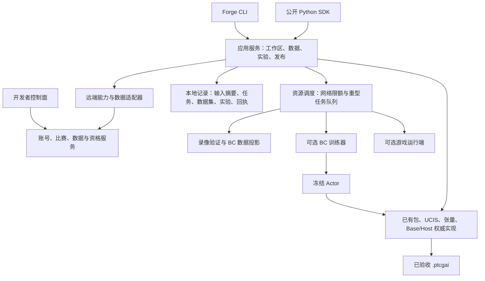

# 下一阶段架构升级：完整开发迭代 CLI、录像数据与 BC 闭环

## 0. 文档控制

| 字段 | 内容 |
|---|---|
| 状态 | **架构提案，待分阶段实施；不是功能上线或验收通过声明** |
| 日期 | 2026-09-08 |
| 需求来源 | 开发者研发体验审查，以及完整迭代 CLI、受控并发获取录像并用于 BC 的补充需求 |
| Forge 审查基线 | `8e47301ab8ef3401e9fdb698d3b4dc1cea54ade5` |
| 提案交付 | 架构、接口草案、职责边界、实施计划和验收标准；提案阶段仅修改文档 |
| 目标制品 | 继续使用 data-only `.ptcgai`，不引入第二种玩家策略制品 |
| 公共策略边界 | `agent(raw_observation) -> list[int]` |
| 实施状态入口 | 根目录 [TODO](../TODO.md) 的 T40–T48 |

本文把此前分散的开发体验问题与录像、训练、评估需求合并为同一升级计划。除明确标注“已有”的能力外，本文的命令、目录、类型、状态和错误码都是拟议合同，不能作为当前可执行使用指南。

当前使用方法仍以 [Quickstart](01-QUICKSTART.md)、[SDK 参考](18-DEVELOPER-SDK-REFERENCE.md) 和 `forge.py --help` 为准。本文不改写既有验收证据，也不将 T37、T38 已完成的入口统一和文档修复扩大为完整研发闭环已经交付。

控制面审查基于本机 `ptcgdojopage` 页面源码；线上页面在本次审查中未成功加载，未进行登录、上传或资格验证实测。PtcgDAP 源码仅用于只读设计核对，不是 Forge 的运行依赖。来源与文件摘要见附录 A。

实施已开始：当前可执行范围与剩余缺口见 [v0.3 实施说明](21-ITERATION-CLI-IMPLEMENTATION.md)。下文保留完整目标合同，不将部分实现视为全部验收通过。

## 1. 目标与首批交付标准

目标是让开发者从一个策略工作区完成以下两条迭代，并使每个结果都能追溯到确切输入：

```text
规则路线：
错误对局 → 公开决策窗口 → 场景与解释 → 规则修改 → 验收 → 对战比较 → 发布

模型路线：
对局查询 → 受控录像采集 → BC 数据资格检查 → 固定数据集
        → BC 训练 → Actor 导入 → 验收与评估 → 发布 → 增量采集
```

**首批交付必须完成“真实对局查询 → 可恢复下载 → 数据资格检查 → BC 数据集”的纵向链路。** SDK 安装、任务调度、版本关联和上传恢复是这条链路的共同基础；不能只增加一组下载命令或漂亮状态页就宣布阶段完成。

同时保留两条可独立运行的本地路径：

- 无账号、无网络时，可以创建本地开发身份工作区，编写规则、导入本地数据、构建和验收；正式上传前另行绑定真实作者身份并重新构建。
- 没有游戏源码检出时，可以采集、审核数据和进行离线训练；真实对战通过显式配置的游戏运行端接入。运行端缺失时明确报告未执行，不以窗口模拟替代实战。

首批验收应使用固定的真实来源小样本，证明存在合格 BC 决策；数量上限、分页、异常、并发和恢复则使用可复现服务 fixture 压测。真实来源没有必要决策字段时，必须补齐导出端后再关闭该交付门。

## 2. 现状、影响与升级归属

| ID | 已观察的现状 | 对研发的影响 | 下一阶段改进 / TODO |
|---|---|---|---|
| DX01 | 当前 `.venv` 直接查找 `ptcg_strategy_forge` 未找到模块；入口与测试手工加入 `src` 路径，未发现标准 Python 打包配置 | 文档中的直接 SDK 导入难以用于普通脚本、Notebook 或仓库外目录 | 可安装 SDK、资源打包和干净环境验收 / T40 |
| DX02 | `StrategyWorkspace.create` 要求父目录先存在；Quickstart 使用的 `work/` 未被 Git 跟踪 | 首次照抄命令可能在创建工作区前失败 | 安全创建父目录、明确身份默认值 / T40 |
| DX03 | `install()` 发现默认包已存在就直接安装；默认报告路径不随构建身份变化 | 修改源码后可能安装旧包，历史验收记录难以对应版本 | 源码—构建—安装关联及不可覆盖记录 / T41 |
| DX04 | `status` 主要检查结构，给出固定 next actions；模型状态读取会执行 conformance | 不能直接判断验收是否过期；轻量查看与主动检查职责混杂 | 分项状态、证据新鲜度、显式刷新 / T41 |
| DX05 | `inspect` 展示窗口与公开事实，不执行策略解释；套件报告保留的是压缩结果 | “为什么没有选预期动作”仍需人工串联低层工具 | 决策解释、反例、版本比较 / T45 |
| DX06 | 测试流程主要复制 JSON、修改 index；内部已有模板和 macro 场景生成器 | 重排、边界和多窗口场景维护成本高 | 通用语义场景构造器与录像窗口导入 / T45 |
| DX07 | adapter 和卡牌查询主要面向原始枚举、UID 和 JSON | 牌组思路转成可执行规则时仍需熟悉底层字段 | 命名化作者接口、卡牌查询、编辑器支持 / T48 |
| DX08 | 网页调用单场录像接口和最近 60 场策略资料；Forge 无录像采集与数据集命令 | 训练数据获取需额外脚本，缺少统一恢复、去重和来源记录 | 能力协商、对局查询与受控采集 / T42、T43 |
| DX09 | 录像实现区分播放帧、决策窗口与 Host 接受记录；最小 BC 示例只读取两条场景 | 下载成功不等于可训练；缺少真实决策数据资格门 | 决策导出合同、BC 数据集流水线 / T43、T44 |
| DX10 | 工作区主入口尚未管理 BC 训练、实验和真实对战比较 | 数据、模型、胜率与版本之间靠人工对应 | 可选本地 BC 基线和统一实验记录 / T46 |
| DX11 | 控制面选包预检主要检查扩展名和大小；上传成功后的账号刷新仍在同一错误链 | 身份错误发现晚；接收成功可能被后续刷新失败遮盖 | 自动身份预检、提交去重和持久回执 / T47 |
| DX12 | 资格页不展开具体失败原因；最近上传主要进入战绩页，最新详情请求失败退回摘要 | 开发者不知道该修什么，读取失败可能表现为等待 | 按 release 的诊断页和独立状态模型 / T47 |
| DX13 | 安装依赖同时包含规则工具与 ONNX/ORT；多处文档维护相同能力说明 | 首次环境更重，命令和文档容易漂移 | 依赖拆分、单一能力元数据和文档回归 / T40、T48 |

本表中的源码判断不等于线上故障发生率；目前尚未采集首次成功时间、上传失败率或研发耗时基线。阶段实施时必须补测，不能把建议指标写成已实现收益。

## 3. 保留的边界与本次范围变化

### 3.1 不变的运行合同

1. `.ptcgai` 仍只含闭合数据；训练代码、数据集、任务数据库、账号凭据和训练 checkpoint 均不进入玩家包。
2. Base/Host 继续拥有合法性、mandatory/terminal、hard tier、veto、数量、fallback 与最终提交权。
3. 每次 accepted selection 后重新观察并绑定当前 options。离线轨迹中的旧 index、tier 和接受证明仅供审计，不得恢复为新窗口的运行权限。
4. 特征通过指定座位、指定时刻的 allow-list 正向投影。对手隐藏信息、牌序、盖奖、私有 RNG、凭据和引擎对象不得进入训练特征或公开证据。
5. 未知字段、UID、generation、选项形状和无法证明的标签 fail closed，给出稳定原因。
6. 开发验收、Godot 见证、CABT 范围一致性、设备验收和 production 批准仍是独立结论。

### 3.2 有限扩展本地研发职责

[统一模型设计](17-UNIFIED-PTCGAI-RULE-AND-MODEL-DESIGN.md) 的首代范围不包含 Forge 训练循环。本文提出下一阶段增加**可选的本地 BC 基线训练器、数据集工具及实验编排**，用于完成开发迭代；不改变玩家模型运行权限，也不表示当前已经支持这些功能。

外部训练仍受支持。Forge 通过版本化数据导出和 Actor 导入合同接入外部训练结果，不要求开发者使用内置算法。新训练器仅执行本机已安装、明确选择的训练实现，不执行录像或下载配置内携带的代码。

本阶段不承诺任意条件策略图、全游戏 RL/self-play 平台、分布式训练、多机资源调度、全卡池官方规则一致性、macOS/Android 实机门或 production 审批。若 BC 需要新公开特征，单独升级张量 profile 并完成双运行时验证，不能在数据处理时私自扩大输入。

## 4. 目标架构与职责



### 4.1 分层原则

- **CLI 层**只解析参数和展示结果；**SDK 层**提供稳定类型和方法；两者调用同一应用服务。逐步迁出 `sdk.py` 对 `cli.py` 的反向依赖，避免把命令行模块变成业务 owner。
- **应用服务层**编排流程，持有工作区与产物关联，不重写包验证器、策略解释器、张量化或游戏规则。
- **端口与适配器层**负责服务能力、分页、下载、身份验证和游戏运行端接入；先定义合同，再绑定经过确认的服务路由。
- **本地记录层**保存不可变 manifest 和可重建索引；数据库不是包、数据或策略真伪的唯一依据。
- **调度层**统一资源准入、取消、恢复和进度；不能通过多开命令绕过并发限制。
- **现有权威实现层**继续决定包/窗口/模型合同是否合法。凡涉及 vendored 文件的实施，按仓库既有快照更新流程执行。

建议模块职责为 `application/`、`records/`、`jobs/`、`services/`、`replays/`、`datasets/`、`training/`、`evaluation/`、`diagnostics/`。这是职责划分，不要求首个提交一次建立所有目录。

### 4.2 跨项目边界

| 责任方 | 负责内容 | Forge 不应代替的工作 |
|---|---|---|
| Forge | SDK/CLI、下载缓存、资格审核、数据集、训练与评估编排、发布客户端 | 不从播放结果猜测当时合法选项，不伪造服务权限 |
| 比赛/数据服务 | 稳定对局目录、分页/快照、数据能力、授权范围、限流、保留期和包接收去重 | 客户端不能依靠枚举私有路径替代正式接口 |
| 引擎/Host 导出端 | 决策前可见输入、完整窗口、实际接受动作及版本一致的公开轨迹 | Forge 不能从未来状态反推缺失决策事实 |
| 网页控制面 | 展示同源状态、上传预检、资格诊断和可恢复操作 | 不维护第二套资格状态推理规则 |
| 产品/运行维护者 | 发布权限、正式信任根、服务部署和实机资格 | 本文不授予这些权限，也不包含外部仓库修改 |

Forge 的安装发行物必须包含受锁合同、资源和模板，允许离开源码目录使用。可选训练依赖与核心规则依赖分别安装；Python 版本要求先保持当前支持范围，扩大平台与版本范围需要另行验收。

## 5. 身份、产物与工作区记录

### 5.1 可追溯关系

```text
源码快照 + SDK/合同摘要 + 场景套件摘要
  → 构建记录 → 开发包 → 安装回执
                  ↓ 重签：payload 不变、archive hash 改变
                上传包 → 接收回执 → 资格事件 → release 对局

对局目录快照 → 录像字节 → 决策数据资格报告 → 数据集 + split
  → 训练配置/代码/seed → checkpoint → Actor
  → 新源码快照 → 新构建/评估记录 → 候选 release
```

各身份域必须分开：`developer_id`、`package_id`、`package_version`、`archive_sha256`、`release_id`、`match_id`、`series_id`、`dataset_id`、`run_id`、`job_id` 不得互相代替。

- `source_digest` 覆盖影响包行为的源文件；`suite_digest` 独立覆盖验收场景与期望。只改场景时，包内容可能不变，但验收必须失效重跑。
- `build_id` 绑定源码、SDK/合同与验收输入；归档 SHA 绑定实际字节。时间戳、机器路径等运营字段不进入确定性包字节。
- `dataset_id` 由输入录像/决策摘要、转换器、过滤规则和 profile 共同确定；处理顺序与下载并发不能改变最终内容。`split_id` 另行绑定 dataset ID、关联分组、分配算法、比例与 seed；创建新 split 不修改已有 dataset manifest。
- `run_id` 是一次训练或评估执行身份，另存可重复的配置摘要。相同配置多次运行也保留独立记录。
- 重签保留 payload 摘要与开发包 SHA 的关联，记录上传包新的 SHA；资格和比赛必须绑定服务端实际接受的上传字节。

### 5.2 建议存储布局

```text
workspace/
  forge-workspace.json          工作区配置、服务别名、schema 版本；不含秘密
  package/                     现有 data-only 包源码
  scenarios/                   现有与导入后的回归场景
  .forge/state.sqlite          工作区索引与任务引用，可由 manifest 重建
  .forge/latest.json           指向最近记录，不是验收证据本身
  build/<build-id>/             不可覆盖包与验收记录
  data/collections/<id>/       固定目录、筛选条件、采集进度与排除记录
  data/datasets/<dataset-id>/  不可变 manifest、分片与数据审核
  data/splits/<split-id>/      关联分组、分区及所绑定的 dataset ID
  runs/<run-id>/               配置、checkpoint、指标、导出与评估记录
  releases/<receipt-id>/       预检、签名关系、接收及资格回执

用户级 Forge 数据目录/
  profiles/                    非秘密账号与服务元数据
  cache/objects/<sha256>/       通过边界检查的内容缓存
  jobs/                        同用户跨 CLI 进程的调度记录
  locks/                       网络预算、重型任务和单写者租约
```

秘密留在操作系统凭据存储或明确的环境凭据中，签名私钥继续位于仓库/工作区之外。受授权、非公开的决策数据缓存按服务与账号范围隔离；哈希相同也不能绕过访问权限。公开证据导出另外执行脱敏和 allow-list 检查。

### 5.3 安装与记录一致性

`workspace install PATH` 安装与当前源码和有效验收对应的包；已有默认文件不构成“最新”的证明。若发生漂移，返回 `workspace_artifact_stale` 并给出构建命令。显式选择历史 `--artifact` 时可以安装经验证的旧包，但回执必须标明它是历史版本。

包、报告和 latest 指针按事务提交；失败不留下“有包无验收”的成功状态。已有同身份同字节操作幂等成功，不同字节冲突拒绝。旧工作区先只读打开；迁移通过 `workspace upgrade --dry-run` 展示变更，再显式执行并保存备份，不重签、不更改旧 `.ptcgai` 字节。

## 6. CLI 与 SDK 合同草案

### 6.1 命令目录

所有工作区命令统一把 `PATH` 放在最后一个子命令之后。仓库内 `forge` 表示 `.\forge.ps1`；完成 T40 后，安装包还提供相同语义的命令入口。

| 阶段 | 拟议命令 | 主要输出 |
|---|---|---|
| 环境 | `doctor`、`service capabilities --profile NAME` | SDK/本机状态、已确认服务能力与限制 |
| 账号 | `account login / whoami / logout` | 当前账号与授权范围，不回显凭据 |
| 基础工作区 | `workspace create / status / check / build / install PATH` | 沿用已有主生命周期，增加可靠记录与新鲜度 |
| 版本 | `workspace version bump PATH --part patch`、`workspace upgrade PATH --dry-run` | 修改预览、版本关联和迁移报告 |
| 对局发现 | `workspace matches list PATH` | 可筛选分页目录，或明确的有限查询范围 |
| 录像 | `workspace replays sync / verify / inspect PATH` | collection ID、任务状态、完整性和数据能力 |
| 数据集 | `workspace dataset build / audit / stats / split / export PATH` | 固定数据集、排除原因、分布、split、外部训练导出 |
| 训练 | `workspace train bc PATH` | run ID、checkpoint、指标；长任务另由 jobs 管理 |
| 模型 | `workspace model inspect / import / tensorize / conformance PATH` | 复用现有合同，接入 run/数据来源记录 |
| 评估 | `workspace evaluate PATH --mode offline\|engine`、`workspace compare PATH` | 明确区分离线与引擎证据的对比报告 |
| 调试 | `workspace explain PATH`、`workspace scenario from-replay / generate PATH` | 决策因果、源位置、可复现回归和变体 |
| 快速回归 | `workspace test PATH --case ID`、`workspace test PATH --changed --watch` | 指定/受影响场景反馈，明确标记未运行完整验收 |
| 编写 | `workspace rules lint / compile PATH`、`cards search / inspect` | 命名化规则检查、能力边界与精确 UID |
| 发布 | `workspace release prepare / upload / status PATH` | 上传前预检、签名关系、接收/资格状态 |
| 全局任务 | `jobs list / status / cancel / resume / retry` | 可恢复任务，重试另记 attempt，保留历史失败 |

SDK 与这些命令调用同一应用服务，按职责暴露 `workspace.replays`、`workspace.dataset`、`workspace.training`、`workspace.evaluation`、`workspace.releases` 等门面；返回版本化结果类型。文件定位、错误归因和任务状态应能被 IDE、Notebook 与网页集成直接使用。

### 6.2 录像到 BC 的拟议示例

以下展示目标使用体验，当前不可执行。尖括号值必须来自前一步的真实输出。

```powershell
forge service capabilities --profile dojo --format json

forge workspace replays sync work\my-model `
  --service dojo --release-id <release-id> `
  --since 2026-09-01T00:00:00Z --until 2026-09-08T00:00:00Z `
  --concurrency 4 --requests-per-second 2 `
  --max-games 1000 --max-bytes 1073741824 --resume

forge jobs status <job-id> --follow
forge workspace replays verify work\my-model --collection <collection-id>

forge workspace dataset build work\my-model `
  --collection <collection-id> --task bc `
  --profile competitive_public_actor_i32_v1
forge workspace dataset audit work\my-model --dataset <dataset-id>
forge workspace dataset split work\my-model --dataset <dataset-id> `
  --group related-match --ratios 80,10,10 --seed 20260908

forge workspace train bc work\my-model --dataset <dataset-id> `
  --split <split-id> --config training\bc.json
forge workspace model import work\my-model --source <exported-actor.onnx> `
  --training-method bc --source-run-id <run-id>
forge workspace check work\my-model
forge workspace build work\my-model
```

对局查询还应支持精确牌组、对手 release、座位和结果等筛选。只有服务端提供稳定字段时才能远端筛选；客户端过滤必须披露扫描的目录范围与截断状态，不能把“最近 60 场内找到 10 场”写成“全部只有 10 场”。下载数量和字节参数是任务预算，不是服务端承诺。

### 6.3 输出、错误与交互

- 交互终端默认显示简明中文摘要、进度和下一步；`--format json` 提供稳定机器输出。重定向 stdout 时默认 JSON；进度写 stderr，不污染机器输出。
- 既有命令的 JSON 与退出码保持兼容；更改默认展示只能在显式版本迁移中进行。保留 0 成功、1 输入/运行错误、2 验收失败；异步提交的 0 只表示任务被接受，最终结果通过 job 查询。
- 通用结果至少包含 `document_type`、`schema_version`、`status`、`operation_id`、产物引用、输入摘要、作用范围与错误列表。
- 错误条目包含稳定 `code`、中文说明、所属层、相对文件/JSON Pointer、可重试性和下一步。未知底层异常归一化为错误，不直接将 traceback 或含秘密的 URL 当成用户错误码。
- 长任务支持 Ctrl+C 安全取消、`--follow`、进度计数和恢复。取消后不自动发布、安装或晋升；同一任务重复查询不触发再次执行。
- 网络操作必须由 account/service/matches/replays/release 等显式动作或显式计划触发；本地 `status/check/build` 不隐式联网。

## 7. 服务能力与受控录像采集

### 7.1 能力协商先于批量抓取

现有网页使用策略 profile 与单场录像调用，未在本次审查中证明服务支持完整历史分页、增量游标、Range、决策附件或批量导出。独立 community replay 合同与连续天梯录像也不能因同称“录像”就共用解析器。

新增适配器首先取得或绑定经确认的服务合同，至少描述：

| 能力 | 必须明确的语义 |
|---|---|
| 目录 | 支持哪些筛选、稳定排序、快照/游标、时间范围、页大小和历史保留期 |
| 录像 | 格式/schema、文件大小、服务端摘要、不可变对象身份、是否存在决策附件 |
| 下载 | 并发和速率限制、`Retry-After`、超时、Range/ETag 支持情况 |
| 可见性 | 公开或账号授权范围、允许导出的座位投影、访问过期和撤销行为 |
| 决策数据 | 是否包含决策前输入、ordered options、accepted choice、Base 参与范围及完整性证明 |
| 发布 | 包大小、签名与账号绑定、提交去重、接收查询、资格事件与重试资格 |

能力缺失返回 `service_capability_unavailable`，并给出可用的有限路径。例如允许导入本地受审 decision trace，或只下载可播放资料；不能暗中改抓网页、猜测未公开 API 或补造训练字段。

服务端新增端点的 URL 和认证流程在接口评审时确认。本文定义语义需求，不宣称存在某个尚未核对的 HTTP 路由。已有浏览器 cookie/CSRF 流程也不能直接当成 CLI 长期认证协议。

### 7.2 两阶段采集

1. **冻结目录。** 保存查询、时间上界、服务版本、快照/游标、明确的条数/字节预算和候选对象身份。使用 `(timestamp, stable_id)` 等稳定复合顺序处理同时间记录；没有快照时重叠扫描并去重，同时披露一致性限制。
2. **执行下载。** 按固定目录调度对象，记录每个对象的状态、尝试次数、已验证摘要与失败原因。新比赛进入下一次 collection，不使正在构建的数据集悄悄变化。

`--resume` 恢复同一任务及相同参数摘要；改变过滤条件、预算或转换合同会形成新记录。下载完成后数据集读取冻结 manifest，不直接读取持续变化的缓存目录。

### 7.3 并发、限速和资源准入

下列为客户端初始建议值，需通过实施测试确认；有效限制取本机、用户配置与服务端限制中更严格者。

| 资源 | 建议默认 / 强制规则 |
|---|---|
| 同服务网络在途请求 | 默认 4；同用户多 CLI 共享 origin 预算，账号配额另外累计 |
| 请求速率 | 默认每秒 2 次，突发 1；重试同样计入限额，遵守服务端 `Retry-After` |
| 排队方式 | 有界任务队列；只流式保留当前页与有限下载对象，不把全量录像加载到内存 |
| 转换执行 | 首代一个转换进程，流式分片；可配置 worker 必须受同一资源门约束 |
| 重型任务 | 本机同一时刻最多一组训练、benchmark、录像重建、simulation 或 evaluation 进程池 |
| `ptcgabc` | 最多 `--workers 4`，继承其 runner 的保护，不通过 Forge 覆盖任何 `PTCGABC_*` 安全阈值 |
| 重型启动门 | 启动前检查现有 Python 进程、可用物理内存和系统 commit；其他重型运行活动、commit ≥70% 或可用 RAM <12 GiB 时不启动 |

网络采集不创建 Python 计算进程池。即便只有下载，也必须限制缓冲、连接、落盘容量和队列长度；资源紧张时停止接纳新对象。字节预算分别约束传输量、单对象、解压后总量和最终数据集大小。

调度通过 Windows 系统级命名互斥与持久租约协调同用户 Forge 进程；不同用户/非 Forge 程序还需结合进程和资源检查，不能只相信本地任务表。进程扫描无法确认安全余量时，重型任务保持等待并解释原因。运行中周期检查资源，到边界时停止新 worker、保存可用 checkpoint 或有序终止，不自动提高阈值。

### 7.4 下载事务与重试

- 写入受限 staging 文件，验证服务身份、schema、摘要和边界后原子纳入内容缓存。身份相同且字节不同返回 `replay_identity_conflict`，不覆盖旧证据。
- 服务端有 hash 时验证它；只有本地 SHA 时只能声明下载字节完整记录，不能据此宣称来源真实性已验证。raw bytes SHA 与 canonical content SHA 分开记录。
- 网络临时失败和受支持的服务忙状态使用指数退避、随机抖动、次数与总时长上限；401/403、永久缺失、未知格式和摘要冲突不做无界重试。
- `Retry-After` 在同 origin 协调，避免多个进程同时恢复形成请求尖峰。取消停止新请求并关闭本任务连接，不影响其他工作区任务。
- 默认保证任务级恢复；仅在服务端支持 Range 且对象 validator 未变化时进行字节级续传，否则重下当前未完成对象。
- 请求 URL、重定向和缓存路径受适配器的来源约束。凭据不跟随跨 origin 重定向；下载位置不能被数据内容指定为任意磁盘路径。
- 过期、无权限、缺失附件和预算截断分别记账；collection 显示完整、部分、失败及可恢复范围，不把部分成功标为完整语料。

## 8. 决策数据与 BC 样本合同

### 8.1 能力分级

| 级别 | 含义 | 允许用途 |
|---|---|---|
| `playback_available` | 有可播放事件/状态帧 | 浏览、战况分析 |
| `decision_trace_available` | 有可定位的决策轨迹 | 进一步检查窗口与接受记录 |
| `bc_eligible` | 已通过目标可见性、版本、完整窗口、标签及模型候选域验证 | 进入指定 BC profile 的数据集 |
| `bc_ineligible` | 缺必要事实、存在污染或目标 profile 不适配 | 保留元数据与排除原因，不输出伪标签 |

这些状态按录像、座位和决策分别计算。某局存在合格窗口不代表每步均合格；某个 profile 合格也不代表其他 profile 可用。已有 native replay 能力字段只能作为检查入口，不能省略内容复验。

### 8.2 决策记录的最小语义

以下是待评审的 `forge_public_decision_record_v1` 字段族，不是当前 wire schema：

| 字段族 | 必要内容 | 用途 |
|---|---|---|
| 来源 | 服务/来源 ID、录像内容摘要、series/match、决策 ordinal、座位 | 审计与分组；不进入模型特征 |
| 版本 | 引擎 build、UCIS/窗口合同、UID/deck/catalog、教师 package/release/hash、Base 合同 | 检查兼容与再现范围 |
| 决策前投影 | 指定座位、指定时刻、经过 allow-list 的输入 | 唯一特征来源 |
| 当前选择窗口 | select type/context、数量规则、完整有序 options、公开 UID binding | 构建当前合法动作域 |
| 动作 | 教师 proposal（若可用）、最终 accepted indexes、选择来源 | 区分意图、裁决和实际执行 |
| 接受证据 | 无 ticket/命令的公开接受结果、前窗口摘要、关联轨迹完整性 | 证明标签属于这一窗口且已接受 |
| 模型参与域 | mandatory/terminal、规则选择层、tier/veto 或可验证的等价候选域 | 验证目标模型允许学习的选择 |
| 独立结果元数据 | 终局、胜负、dirty/error/fallback 标志及公开统计 | 质量分析、采样；不混入决策前特征 |

观战视角若缺少玩家当时可见且目标 Actor 必需的信息，就不能冒充该玩家输入。即使下载内容包含赛后揭示的牌，也不得回填过去窗口。账号可访问完整文件不等于里面每个字段都能进入该座位的策略特征。

过滤器先在有界入口检查数据来源与允许字段；遭遇隐藏字段污染时拒绝或隔离，不把原始污染内容写入公开诊断。缺失信息只在目标 profile 明确支持 presence 缺失语义时保留；否则返回 `dataset_required_fact_missing`，禁止默认填成 0 来伪装完整事实。

### 8.3 标签与张量行映射

当前 `PublicActorTensorizer` 会按公开语义重排 option 行，`option_mask_i32` 表示真实行与 padding，不等于 Base 授权的模型候选 mask。数据处理必须同时保留并校验以下映射：

```text
原始 ordered options 中的 accepted index
    → current_index_to_row
    → 当前 tensor profile 的监督标签行
    → row_to_current_index 反向复核原 accepted index
```

重排测试必须同时变换 options、公开 binding 和标签，再证明选中相同公开语义；不得持久复用跨窗口 index。重复语义选项需保留实例辨识与当前索引映射，不能因哈希相同合并为一个选项。

默认 `bc_policy_preference_v1` 仅把可证明、目标 Base 允许模型参与的选择作为监督目标：

- mandatory、terminal 和仅一个可选动作单独统计，默认不进入偏好学习损失。
- fallback、timeout、invalid/rejected 窗口分别记录；不以 fallback 自动替代教师标签。dirty 整局默认不进入训练，保留排除统计。
- 教师来自不同 Base/版本时，不能直接把旧 tier 当成目标权威。必须由兼容合同或目标 Base 对公开窗口的复验确认候选域；无法确认就排除。
- 教师动作不在目标候选域时报告不适配，不将它投影到“最近合法动作”后继续称作 BC 标签。
- 终局胜负只属于质量元数据；默认不只训练胜局，不把胜者每步都视作优质决策。按教师版本、对局类型和质量分层，固定采样配置。

数量与多步语义按窗口类型处理：单选监督一行；多选监督合法集合及所需数量；NUMBER 监督对应数值 option；YES/NO 监督对应 option；逐次 source→target 与伤害分配各自形成 fresh window 样本并保留关联。`desired_count` 是本窗口返回 index 数量，不能与 NUMBER option 的数值或 energy units 混同。

初版训练器若只支持某些窗口类型，必须在能力清单中列出，并报告其余样本排除数量。数据格式支持完整语义，不允许为适配简单训练器把多选局面错误压成单选。

### 8.4 特征充分性门

目前张量 profile 主要包含公开时钟、turn flags、选择语义、option 字段与 UID 特征，并不自动覆盖策略蓝图中的全部资源和威胁语义。BC 数据越多也不能补偿缺失的决策输入。

数据审核应检测“相同张量输入对应不同教师动作”的冲突率，并按 context、教师和缺失字段分解。可将充分性问题转为新 profile 需求，但新 profile 必须显式版本化，锁定训练与推理转换器，完成 Python/Godot 合同向量与性能门；不静默改变当前 `[1,24]`、`[1,1024,16]` 输入。

## 9. 数据集构建、分区与导出

### 9.1 流水线

```text
冻结 collection
  → 格式/来源/可见性检查
  → 窗口与接受动作核对
  → 版本/UID/Base 候选域审核
  → 张量投影和标签映射
  → 去重、质量分层、相关比赛分组
  → 固定 train/validation/test
  → 分片 + manifest + 审核报告
```

分片采用确定性顺序和有界内存；JSONL 用于可读诊断，训练数组格式由版本化 export profile 指定，默认不输出需要执行任意对象的 pickle。数据集 manifest 固定输入内容摘要、转换器、张量/Base/profile、教师集合、过滤配置、行数/排除数和分片 SHA。分区形成独立不可变 split manifest；训练输入清单同时绑定 dataset 与 split 摘要，不能在原数据集内就地替换划分。

缓存只能按完整转换输入摘要命中；不能因为文件名相同复用不同合同下的数据。变换失败不发布完整 dataset manifest；继续执行生成新 attempt，保留失败历史。

### 9.2 分区与去重

- 先识别重复录像与相关比赛，再分区；同一 match 的两座位、同 series 换座局、同来源重建/重排/增强样本进入同一组。
- 可证明相同初始局面的 seed/赛程关联纳入分组；私有 RNG 和隐藏 seed 不作为特征或公开证据，缺少关联信息时报告风险与未知范围。
- 默认 80/10/10 是建议比例，按组确定性分配；小数据不足以形成有效留出集时明确失败或标记仅开发用途，不复制样本填满分区。
- 固定 seed、教师版本和来源范围；训练增强在分区后执行且继承原组。测试集不参与样本筛选、调参或模型选择。
- 为持续采集保留固定测试 cohort；新增 collection 形成新 dataset，不悄悄修改已经参与评估的数据集。

### 9.3 必须提供的统计

至少输出对局数、决策数、合格率、排除原因、教师/牌组/对手/座位/context 分布、多选与 NUMBER 占比、fallback/dirty 情况、缺失事实、特征冲突和跨 split 重复检查。终局与质量元数据可被用于预先声明的分层采样，但不成为输入特征。

数据审核通过只证明指定合同下的数据可用性，不保证教师强度、BC 强度或官方规则结果一致。

## 10. 任务调度、状态和恢复

任务状态建议为：

```text
planned → queued → running → succeeded
                   ├──────→ partial
                   ├──────→ failed
                   ├──────→ interrupted
                   └──────→ cancel_requested → cancelled
```

`waiting_reason` 描述资源、服务限流或依赖等待；`partial/failed/interrupted/cancelled` 是否可恢复由具体操作和 checkpoint 决定，不能通用承诺原位继续。`resume/retry` 创建新的 attempt，继承经过验证的缓存与 checkpoint，保留原失败记录。

任务记录包含操作类型、输入/配置摘要、所属工作区、资源配置、进度、lease、checkpoint 和输出引用。进程崩溃后验证 PID 与启动身份及租约，再释放失效锁；不能单凭旧 PID 判断任务仍在运行，也不能抢占活跃任务的锁。

`workspace status` 是轻量只读汇总，分别报告：结构、源码是否变化、验收是否有效、Actor 检查是否过期、安装身份、数据任务、实验、发布接收与最后一次资格观察。主动 conformance 或远端刷新是显式操作。

下一步由当前目标版本、阻塞原因与操作能力生成。旧版本失败不抢占新版本正在评估的提示；没有服务状态时显示“未知/需刷新”，不推断为排队、通过或失败。

## 11. 决策解释、场景与规则作者接口

### 11.1 决策解释

`workspace explain` 接受场景或通过审核的录像决策引用，执行现有 Host/策略路径，输出：

- 实际与期望语义动作及当前 indexes；
- 命中规则、关键谓词实际值、未满足前提；
- mandatory/terminal、hard tier、veto、数量及模型参与的裁决链；
- 为什么候选被淘汰，以及源规则 ID、文件和 JSON Pointer；
- 与指定基线包在同一窗口的行为差异。

只改变一个公开事实的反事实检查必须重新形成合法窗口并复验，不能绕过 Base 来模拟“如果强行选了会怎样”。单窗口 counterfactual 不声明整个游戏后续结果。

`inspect`、`explain` 和 `scenario from-replay` 应支持已声明的原始窗口场景与 Competitive v2 场景；按格式能力分派，无法转化时给出具体缺口，不能宣称统一入口却只处理其中一种格式。

日常修改可运行指定场景或受影响场景；显式 `--watch` 只监听本地作者输入，合并短时间内的连续修改，一次只执行一个检查任务。快速反馈仍通过现有窗口/Host owner，不建立宽松解释器；缓存按源文件与合同摘要失效。快速回归不出具发布资格，也不替代 `check/build` 的确定性双构建与完整套件。未修改且输入摘要完全一致的已验收包可由构建记录复用，前提是先重新核对摘要，而非按文件存在判断通过。

### 11.2 场景和作者层

语义构造器负责精确 UID、合法窗口、绑定与期望；自动生成 option 重排、缺前提、错误目标、mandatory/terminal、hard tier/veto、未知 UID、隐藏字段和关键阈值成对用例。已有模板生成器继续复用，扩展为稳定作者入口。

录像导入保留原始来源摘要与公开窗口定位，不带入隐藏帧；人工期望与实际教师选择分别记录。首次应能复现旧包 RED，再验证修复 GREEN。

命名化规则构造器和编辑器 schema 编译到现有 IR，不产生玩家可执行 Python。支持卡名检索用于发现，最终由作者确认精确 printing/UID；交互支持、规则见证、IR 可表达性、模板覆盖分别展示。

## 12. BC 训练、导出与评估

### 12.1 最小可用训练能力

内置 BC 是可选开发依赖，提供可复现基线、分片读取、明确的窗口类型支持、seed、checkpoint、安全取消与恢复、验证集选择和最终 Actor 导出。训练日志记录 loss、语义动作准确率、精确集合/数量准确率、context 分布、候选域不适配率和耗时。

外部训练可使用 `dataset export`，导出格式包含特征/profile/hash、标签行映射、split 和使用说明；只导出所授权的样本，不随之导出账号凭据或不必要的原始录像。外部 Actor 仍经现有 import/conformance 与完整规则 fallback 验证。

恢复训练须核对数据集、split、训练代码/配置和依赖摘要；不一致时新建 run。checkpoint 是否可跨版本恢复由训练器合同声明，不通过读取不可信序列化对象实现自动迁移。

训练精度与导出后 CPU ORT 行为分别测量。整数转换/量化前后在固定留出窗口上核对语义选择、数量、fallback 和延迟；只在训练框架中准确不构成包可用证据。

### 12.2 两条评估门

| 评估 | 必须输出 | 不能推出 |
|---|---|---|
| 离线 | 留出集动作/集合/数量指标，按 context 分解，教师与候选域一致性，导出前后行为差异 | 不等于对战胜率提升 |
| 游戏运行端 | exact 包与引擎、对手版本、固定赛程、换座、seed 分组、完整比赛结果、录像和调用审计 | 不自动等于 CABT full-rule、其他设备或 production 批准 |

比较候选与基线时固定可比较的规则环境、对手和种子计划，报告配对结果、不确定性与全部异常。另用未参与调参的新对局验证；不以最近 60 场滚动战绩替代受控 A/B。异常局保留并报告，不能默默删除后宣称干净胜率。

游戏运行端可以是明确配置的已安装开发运行包或受审服务，不要求相邻源码仓库。连接前查询能力；不可用则返回 `evaluation_engine_unavailable`，离线结果仍保留且独立展示。

候选晋级使用预先固定的验收计划：合同/隐私/非法动作/旧窗口/dirty/signature 全部为硬门；强度与性能阈值在运行前声明。训练完成不自动安装、上传或切换线上版本。

## 13. 发布与网页控制面

### 13.1 身份预检与可靠接收

`release prepare` 解析包并对照已明确选择的账号：完整 author ID、短 package ID、版本、key ID、有效公钥、payload/归档 SHA、最近验收和服务能力。网页选择文件后展示相同信息；客户端预检不能替代服务端验签。

签名继续在本机完成。公钥登记提供结构化导入与指纹核对，私钥不进入网页或上传体。账号登录采用正式服务授权流程，权限区分读取公开对局、读取授权决策数据和提交本人 release；未提供 CLI 授权合同时明确列为外部依赖。

上传流程分成独立持久步骤：

```text
本地预检 → 本机签名 → 开始提交 → 确认接收 → 刷新资格/展示
                              └→ 接收结果未知 → 查询/对账
```

每次逻辑提交固定 idempotency identity 与包 SHA。服务端已有同身份同字节则返回同一 release，不同字节冲突拒绝。连接中断时先查询接收结果；服务不支持对账时返回 `release_receipt_unknown`，不自动重复 POST。

取得 release ID 后立即持久化回执，再刷新账号或资格；后续读取失败不会把“已接收”改为“上传失败”。UI 和 CLI 都锁定当前提交，展示上传进度与接收确认的区别。

### 13.2 资格状态与诊断

上传、包合同、作者签名、运行资格、参赛状态是独立字段，服务端提供明确枚举与每步证据；前端不使用字符串正则或缺字段默认值推断业务状态。

每个 release 提供独立详情，至少包含：包 SHA、阶段、失败码与可公开证据、可修复项、重试条件、排队/开始/结束时间和 `observed_at`。读取失败显示未知与最后一次成功观察，不能显示“等待中”掩盖网络或合同问题。

支持有退避的显式跟踪/刷新，或服务声明支持的事件订阅。历史上传按策略与版本组织；失败进入诊断页，通过后进入比赛与录像页。旧失败默认保留历史，不持续压过当前候选的行动提示。

网页和 CLI 共用状态/错误/能力合同，控制面展示实现由页面项目负责。Forge 客户端可先通过 fixture 实现，但现网接收、重试与诊断验收必须有真实服务证据。

## 14. 实施阶段与依赖

所有工作项初始均为 PENDING；“文档完成”不会关闭实现项。阶段编号表达依赖，不是日历工期承诺。

| 阶段 | 工作与 TODO | 依赖 | 阶段出口 |
|---|---|---|---|
| M0 基础 | T40 安装与首次创建；T41 产物/状态；T42 任务与资源门；T47 提交结果恢复合同 | 现有 workspace/Host owner | 空环境原样上手；旧包不误装；任务恢复与全局限制；上传成功不被刷新错误覆盖 |
| M1 录像入口 | T43 服务能力、目录、受控下载、决策数据探测；与导出/服务 owner 确认所需字段 | M0；正式读取权限与来源合同 | 同一任务可中断恢复、限流与去重，至少一份真实来源记录可核对；明确 BC 可用与缺口 |
| M2 BC 数据纵向交付 | T44 审核、标签映射、分片、分区与导出 | M1；必要决策记录已由源端提供 | 真实录像形成固定合格数据集，跨并发重复构建摘要一致，train/test 无关联泄漏 |
| M3 研发解释 | T45 explain、录像转场景、重排/阈值生成；T48 作者接口/卡牌发现 | M0；录像导入依赖 M1/M2 | 失败窗口可解释并生成 RED→GREEN 场景；无法表达的意图明确报错 |
| M4 训练与评估 | T46 可选 BC、checkpoint、Actor 导出、离线/引擎评估与比较 | M2；目标 runtime/profile；M3 提供失败回归 | 数据→Actor→包→受控 A/B 全链可复现，所有强度/设备声明范围明确 |
| M5 发布反馈 | T47 完成账号/预检/接收/资格/控制面联调；T48 文档元数据收口 | M0 的恢复基础；真实服务；M4 候选 | release 回执关联新对局，增量同步开启下一次数据迭代，无需手工寻找包与报告 |

M0–M2 是首个可用版本的必交链。M3 的本地解释和场景工具可提前实现；M5 的上传防重复、身份预检与资格原因展示不应等到训练器完成才修复。

### 14.1 外部依赖清单

| ID | 待核实/补齐事项 | 缺失时的行为 |
|---|---|---|
| EXT01 | 正式 CLI 认证与读取/上传权限范围 | 公共只读能力可用；账号功能标记未支持，不复用网页秘密 |
| EXT02 | 对局目录的分页、快照、历史保留与增量语义 | 报告有限窗口和截断，不宣称已采集全部历史 |
| EXT03 | 决策前公开输入、完整 options、Host accepted choice 和允许导出的座位范围 | 可播放资料单独保存；相关决策不得进入 BC |
| EXT04 | 服务摘要、Range/ETag、速率与大小上限 | 使用保守客户端限制；无 validator 不分段续传；可信来源状态明确 |
| EXT05 | 上传去重/接收查询、版本化资格详情与重试条件 | 接收不确定时停止重传并提供查询指引；资格显示未知 |
| EXT06 | 可分发游戏运行端及精确包评估接口 | 仅离线评估，不声明实战 |

每项关闭需记录服务/引擎版本、合同摘要和集成回执。外部端未上线时，客户端 fixture 通过只计为本地合同实现，不计为完整链路完成。

## 15. RED→GREEN 验收矩阵

实施遵循“最早 owning layer → 先失败测试 → 最小修复 → 重排/负例 → 针对性测试 → 受影响工作区 check”。下表为必须落地的证据，不是本次已执行的测试。

| 门 | 必须验证的失败与成功行为 |
|---|---|
| G01 首次使用 | 空环境安装、仓库外 import、Notebook、缺父目录、完整 developer ID、短 package ID、无账号本地创建 |
| G02 产物 | 源码/场景/SDK 漂移使验收过期；默认安装拒绝旧包；历史显式安装可追溯；报告写入失败不标成功；同身份冲突 |
| G03 任务资源 | 两个 CLI 同时采集仍受总限额；另一重型运行/commit 70%/RAM 12 GiB 边界；crash lease、取消、恢复、受限队列 |
| G04 网络 | 多页同时间记录、游标过期、目录变动、429/Retry-After、超时、401/403、重复对象、摘要冲突、预算耗尽、Range validator 变化 |
| G05 决策数据 | 播放帧缺决策、缺接受记录、错座位、未来/隐藏字段、未知 UID/schema、链断裂、错误窗口标签均给出稳定排除原因 |
| G06 BC 标签 | option 重排与双向行映射；重复语义实例；单选/多选/NUMBER/YES_NO/分配；mandatory/terminal/tier/veto；候选不适配与 fallback |
| G07 数据确定性 | 同输入、不同下载并发与到达顺序得到相同 dataset 摘要；同局双座位/换座/重建/增强不跨 split；改 profile 不命中旧缓存 |
| G08 训练导出 | 数据/配置漂移拒绝原 run 恢复；安全取消；固定留出集；导出后 ORT 语义、精确数量、异常 fallback 和运行预算 |
| G09 调试编写 | 原失败窗口 RED、修复 GREEN；规则/文件定位；自动重排和单事实阈值翻转；不支持的 IR 意图明确拒绝 |
| G10 发布状态 | 错作者/错误 key/旧包在预检发现；双击去重；服务已接收但响应丢失可对账；成功后刷新失败保留回执；历史失败不遮盖当前版本 |
| G11 完整闭环 | 真实来源→BC 数据→训练→ORT→check→声明范围内的评估→明确执行的上传→资格查询→release 对局增量同步 |
| G12 独立性兼容 | 无相邻仓库运行、离线核心流程、旧 CLI/包 exact 兼容、迁移 dry-run/回滚、凭据不进入包/数据/报告 |

G03 的内存门可用注入的系统快照测边界，不通过实际耗尽机器内存制造 RED。资源使用实测也必须先满足仓库安全条件。网络压测使用本地受限服务；真实服务只做其允许范围内的集成取证。

每个阶段报告保存准确源码/合同/输入/产物摘要、测试结果、未关闭外部依赖、non-claims 和回滚身份。正常日志不记录隐藏 payload，公开证据继续执行 allow-list 与禁止字段扫描。

## 16. 体验指标、迁移与完成口径

### 16.1 指标

实施前测量基线，按同机器/同输入与网络条件比较。以下是建议验收目标，尚无达成证据：

| 指标 | 目标 / 测量方法 |
|---|---|
| 首次本地成功 | 依赖下载完成后，新作者按短指南在 10 分钟内创建、inspect、check 并得到首包；独立统计安装时间 |
| 错误决策复现 | 已有合格 trace 时，5 分钟内定位决策并生成可运行场景；不含人工策略设计时间 |
| 包身份可信度 | 源码变化后默认误装旧包 0 次；每个安装/上传均可回溯到 SHA 和验收 |
| 采集恢复 | 中断后已完成且校验通过的不可变对象重复下载 0 次；永久失败、截断和未知结果有独立计数 |
| 资源控制 | 跨 CLI 总并发/速率不超配置，重型任务同时运行池数量不超过 1，不绕过内存门 |
| 数据正确性 | accepted label 合法且映射往返一致；已识别相关比赛跨 split 泄漏 0；未知范围披露 |
| 发布恢复 | 同一逻辑提交重复创建 release 0 次；已接收事实被后续刷新失败覆盖 0 次 |

状态读取与单场 explain 的 P50/P95、下载吞吐、峰值内存和转换吞吐都应记录。性能阈值在代表性 fixture 上先建立基线再冻结，不把大量重复 check 隐藏在普通读取命令中。

### 16.2 迁移与回滚

- 新本地记录使用独立 schema generation；迁移前提供计划和备份，失败保持旧目录可用。
- 旧 `.ptcgai`、旧构建/发布回执和历史数据不就地重写；新合同产生新产物。
- 核心规则依赖、数据工具和训练依赖分离；关闭新训练/服务适配器后，旧规则开发流程仍可运行。
- SDK 资源搬迁只改变发行访问机制，不擅自改动 vendored 内容或手写 manifest hash。升级时依既有受审快照流程取证。
- 无需新增默认后台常驻服务。首代由明确启动的 CLI/job 执行；自动周期采集是后续显式配置，不因记录任务就无限抓取。

完成报告必须分开列出：已实现的本地 CLI/SDK、公开窗口模拟、真实数据来源集成、Godot 引擎见证、CABT 限定范围、设备验收、production 批准，以及仍未支持的能力。设计、fixture、数据审核和胜率分别证明自己的范围，不能相互替代。

## 附录 A. 审查来源与摘要

本次未运行重型训练或 benchmark，也未对线上账号写入。Forge 基线工作树审查时为 clean；页面目录未发现 Git 仓库元数据，因此以实际文件 hash 标识。PtcgDAP HEAD 为 `b4608d2e2666de6b71d5ab36685650374e5c681e`，下列 replay 文件另以实际 bytes 固定。

| 来源 | 文件 | SHA-256 |
|---|---|---|
| Forge | [sdk.py](../src/ptcg_strategy_forge/sdk.py) | `8F9619D2A97E7F3075B09A23B8DA34967D8CEFD8A6B2908B144E2251F5695809` |
| Forge | [cli.py](../src/ptcg_strategy_forge/cli.py) | `08276D59F702563A49B96E25B0DBB19C1BE605503296C40351E67774B45EECE3` |
| Forge | [ptcgai_model_actor.py](../scripts/ai/ptcgdap/ptcgai_model_actor.py) | `A48E974EE9F1F0ADCB74B25216748CABED48A7A3D050E943956A075F63592F04` |
| Forge | [train_minimal_actor.py](../examples/minimal-bc-rl-marnie/train_minimal_actor.py) | `A0BB1A0D0FED4175286E46108EE39907FBF5886259E7E4006260746D6F2A5C23` |
| `D:/ai/code/ptcgdojopage` | `public/scripts/competition-platform.js` | `6520907AB04E38EFFD8E52A865F642521F22C9341C63CE74D179245630D8021E` |
| `D:/ai/code/ptcgdojopage` | `src/pages/developers.astro` | `D8005E78E487B2B393C5D9E10C7D02A58708E47029F67D683A02C13BB70EA0DD` |
| `D:/ai/code/PtcgDAP` | `scripts/engine/NativeReplayIntegrityWriter.gd` | `3CE118C39F8C8A234D5FE71DA5FEAEF98588E1A150B268D81ACE42368CE2E343` |

外部路径只用于说明设计审查来源，不是安装或执行前置条件。后续接口开发还须核对目标服务部署版本及其合同，不能从本机页面源码推定线上能力已经存在。
